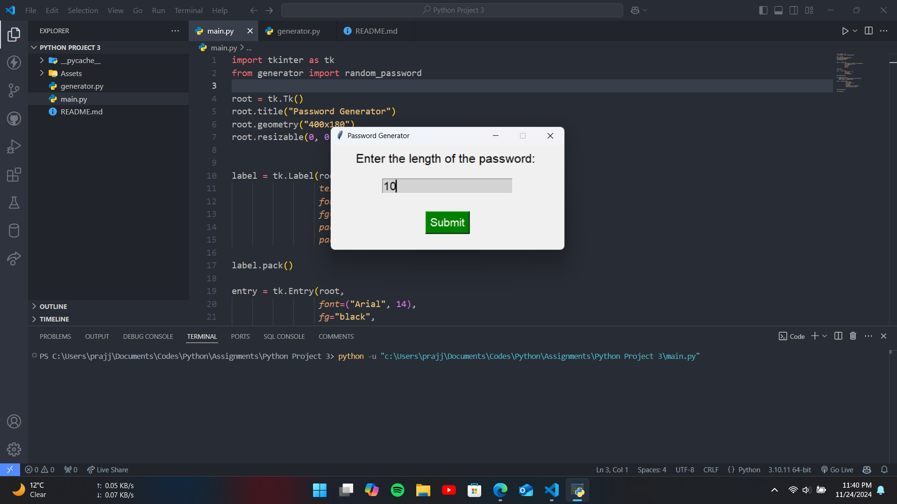
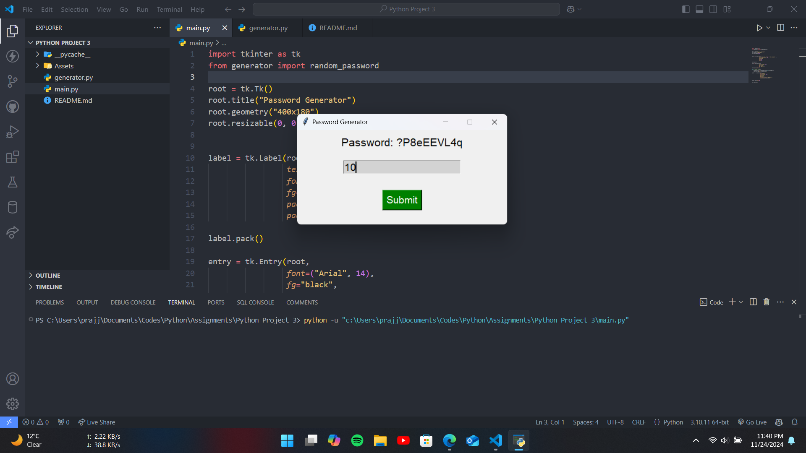

# Random Password Generator

## Overview

The **Random Password Generator** is a Python-based tool that allows users to generate random password with a graphical user interface (GUI). This project uses the `random` library for organizing the files and `tkinter` for creating the GUI.

## Features

- Easy-to-use graphical interface with `tkinter`.
- Generates random passwords of the given length.

## Usage

1. Launch the program by running `main.py`.
2. The GUI will open with one field:
   - **Enter the length of the password** : Enter the length of the password to generate
3. Click **Submit** button to generate password.
4. A random password of the given length appears.

## Screenshots

---